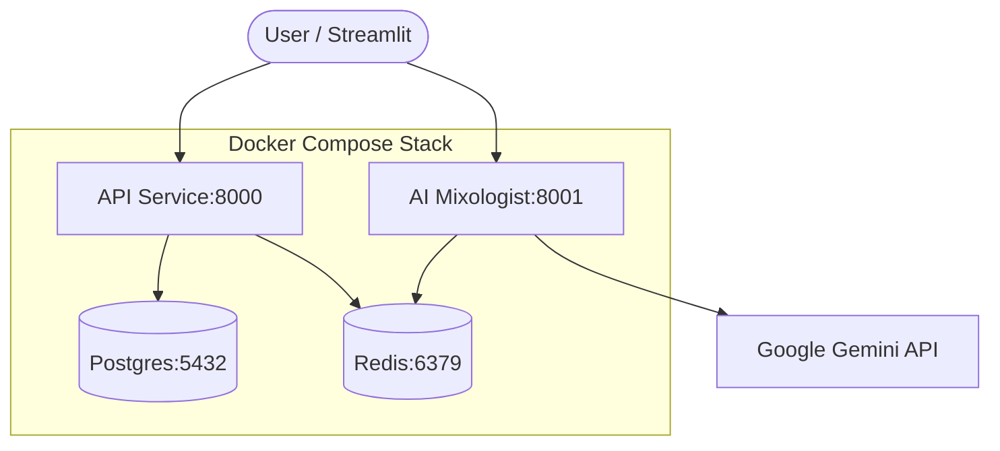

# EX3 Notes — AI Mixologist Microservice

## Architecture Overview



## Service Descriptions

| Service | Port | Responsibility |
| :--- | :--- | :--- |
| **API** | 8000 | FastAPI backend managing ingredients, cocktails, and auth (JWT RBAC). |
| **Postgres** | 5432 | Relational database for persistent storage of all recipe and user data. |
| **Redis** | 6379 | In-memory store for AI response caching and client-side rate limiting. |
| **AI Mixologist** | 8001 | Standalone FastAPI service interfacing with Google Gemini for cocktail logic. |

## Design Decisions

- **Separate AI Microservice**: Decoupled from the main API to allow independent scaling, specialized dependencies (Google AI SDK), and isolated failure domains.
- **Redis for Caching & Idempotency**: Used to minimize expensive/latency-heavy LLM calls and track processed items during batch refreshes.
- **Dual-Mode Database**: Supports both SQLite (for local dev) and PostgreSQL (for production/Docker) via `POTION_DATABASE_URL` abstraction.
- **JWT RBAC**: Implemented role-based access control (Admin/Editor/Viewer) to secure mutation endpoints while keeping GET requests public.

## JWT Rotation Steps

1. **Generate New Secret**: Create a high-entropy string for signing.
2. **Update Environment**: Change `POTION_JWT_SECRET` in `.env` or Docker Compose environment.
3. **Restart Services**: Run `docker compose up -d` to apply the new secret to the API service.
4. **Re-authentication**: Existing tokens will become invalid; all users must log in again to receive new tokens.

## AI Substitution Enhancement ("What Can I Make?")

The "What Can I Make?" dashboard now includes an **AI Substitution** feature:
- **Trigger**: Only appears for cocktails where the user is missing 1 or 2 ingredients.
- **Action**: A "Get AI Substitutions" button calls the AI Mixologist service.
- **Output**: Returns specific ingredient replacements and explains why they work within the flavor profile.
- **UI**: Suggestions are displayed inline using Streamlit status elements for immediate feedback.

## AI Integration Approach

- Added a standalone FastAPI microservice under `ai_service/` with two endpoints:
  - `POST /mix` for cocktail generation
  - `GET /health` for service health
- Gemini integration lives in `ai_service/gemini_client.py`.
- Request and response are strictly validated through Pydantic models in `ai_service/schemas.py`.
- Gemini is called with JSON-only structured output and parsed into `CocktailSuggestion` before returning.

## Rate Limiting Strategy (15 RPM)

- Implemented client-side rate limiting with Redis sorted set (`ai:mixologist:requests`).
- Sliding window logic:
  1. Remove entries older than 60 seconds.
  2. Count current window entries.
  3. Reject with `429 Rate limit exceeded` when count reaches 15.
  4. Record current request timestamp and set key expiry.

## Redis Caching Behavior

- Cache key format: `cocktail:{md5(hash of sorted ingredients + mood + preferences)}`.
- Cache lookup runs before rate limit + Gemini call.
- Cached values are serialized `CocktailSuggestion` JSON.
- TTL is 3600 seconds.
- Verified by making identical `/mix` calls and observing lower response time plus Redis key presence.

## Example AI Response

```json
{
  "name": "Gin Tonic Highball",
  "ingredients": [
    {"ingredient": "gin", "amount": "1 oz"},
    {"ingredient": "tonic", "amount": "1 oz"}
  ],
  "instructions": "Build over ice and stir gently.",
  "flavor_profile": ["balanced", "refreshing"],
  "why_this_works": "Ingredients complement each other through acidity, sweetness, and aroma balance."
}
```

## Docker Compose Integration

- Added `ai_service` to `compose.yaml`:
  - Build from `Dockerfile.ai`
  - Expose port `8001`
  - Inject `GOOGLE_API_KEY` and `POTION_REDIS_URL`
  - Depend on healthy Redis service

## Refresh Script Execution Log

```text
2026-03-29 22:07:38,557 INFO {"ai_service_url": "http://localhost:8001", "event": "refresh_started", "max_concurrent": 5}
2026-03-29 22:07:38,613 INFO {"cocktail_id": 1, "cocktail_name": "Negroni", "event": "cocktail_skipped", "reason": "already_processed"}
2026-03-29 22:07:38,614 INFO {"cocktail_id": 4, "cocktail_name": "Daiquiri", "event": "cocktail_skipped", "reason": "already_processed"}
2026-03-29 22:07:38,629 INFO {"attempt": 1, "cocktail_id": 11, "cocktail_name": "Espresso Martini", "elapsed_ms": 16.06, "event": "cocktail_refreshed"}
2026-03-29 22:07:38,670 INFO {"event": "refresh_finished", "failed": 0, "processed": 8, "skipped": 15, "total": 23}
Refreshing cocktails ━━━━━━━━━━━━━━━━━━━━━━━━━━━━━━━━━━━━━━━━ 23/23 0:00:00
```
