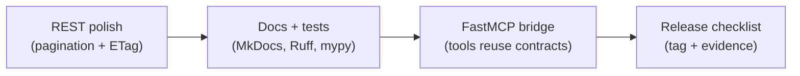

# Session 12 – Tool-Friendly APIs & FastMCP Finish Line

- **Date:** Monday, 01/06/2026
- **Theme:** Lock down the EX3 release by polishing every externally facing surface—pagination, ETags, docs, automation—and show how the same contracts plug into FastMCP so tools can call your API hands-free.

## Session Story
You enter Session 12 with a production-shaped stack: FastAPI + Postgres + Redis + background workers + Streamlit/React surfaces and security controls. Now it is about finish-line polish—make responses deterministic, document them rigorously, and prove automation + tooling are airtight so EX3 demos impress external reviewers. This meeting is a release-engineering sprint: align the REST contract with CSV + pagination, add caching clues, run every lint/test/doc tool, and mirror the contract via FastMCP so assistants can call the service without custom glue.

## Learning Objectives
- Publish deterministic REST responses with pagination, CSV export, and OpenAPI examples that mirror your clients.
- Return caching-friendly metadata (ETag + `If-None-Match`) and document the contract inside `docs/service-contract.md`.
- Automate quality gates (MkDocs/pdocs, Ruff, mypy, pre-commit, changelog) so releases are repeatable.
- Bridge the API to FastMCP by exposing at least one MCP tool that reuses the `/movies` vocabulary.

## What You’ll Build
- Pagination helpers + query dependencies (`page`, `page_size`, `format`) and updated `/movies` FastAPI route that returns metadata + deterministic ordering.
- CSV export path powered by `csv.DictWriter` (or pandas) and `StreamingResponse`.
- ETag middleware/utility that hashes response payloads and honors `If-None-Match` for 304 responses.
- `docs/service-contract.md` + OpenAPI examples that describe pagination headers, CSV shape, and caching semantics.
- Release automation: MkDocs/pdocs build, Ruff, mypy, pytest, Schemathesis, `pre-commit`, and `docs/release-checklist.md`.
- A FastMCP tool (`scripts/movies_mcp.py` + `scripts/mcp_probe.py`) that reuses the same repository calls as REST.

## Prerequisites & JiTT
1. Pull latest EX3 changes and make sure `docker compose up --build`, `uv run pytest --cov`, and `uv run schemathesis run docs/contracts/openapi.json --dry-run` all succeed.
2. Install finishing tools if missing:
   ```bash
   uv add mkdocs-material pdocs ruff mypy pre-commit
   uv add "mcp[cli]>=1.1.0"
   ```
3. Seed at least six movies (`uv run python scripts/db.py bootstrap --sample 6`) so pagination and CSV exports show interesting data.
4. Create/refresh `docs/release-checklist.md` with owner, trigger commands, screenshot/log requirements, and FastMCP verification steps.
5. Sync `.env` + `.env.example` with any new settings (`MOVIE_LIST_DEFAULT_PAGE_SIZE`, `MOVIE_ETAG_SALT`, etc.).

> 🧭 **EX3 Deliverable:** Pagination + ETag on one list endpoint, CSV export, OpenAPI examples, MkDocs/pdocs + Ruff + mypy + pre-commit automation, a FastMCP probe that replays the same contracts, and an updated release checklist.

## Toolkit Snapshot
- **FastAPI + SQLModel** – still the backbone; today you add pagination params, CSV routes, and deterministic ordering.
- **httpx + pandas/csv module** – verifying CSV output and writing quick smoke scripts.
- **uv** – runs lint/test/doc commands and the FastMCP probe.
- **Ruff + mypy + pytest + Schemathesis** – quality gates required before you tag EX3.
- **MkDocs/pdocs** – generate docs directly from code, linking OpenAPI + service contract references.
- **pre-commit** – enforces formatting, Ruff, mypy, doc builds before pushing.
- **FastMCP** – exposes the same movie vocabulary through Model Context Protocol for assistants/tools.

## Agenda
| Segment | Duration | Format | Focus |
| --- | --- | --- | --- |
| EX3 dry run | 10 min | Demos | Walk through local run + contracts. |
| Tool-friendly patterns | 15 min | Talk | Pagination, deterministic responses, CSV notes. |
| FastMCP spotlight | 10 min | Live demo | One REST verb mirrored as an MCP tool. |
| Release hygiene | 10 min | Talk | Docs, lint, tests, changelog. |
| **Part B – Lab 1 (Polish)** | **45 min** | **Guided build** | Pagination, ETag, CSV export, OpenAPI examples. |
| **Part C – Lab 2 (Automation)** | **45 min** | **Guided runbook** | Docs build, `pre-commit run --all-files`, release checklist rehearsal, FastMCP probe. |
| Closing circle | 5 min | Discussion | Commitments for EX3 showcase. |

## Part A – Core Moves
1. **Deterministic responses:** Add `page`, `page_size`, `sort` defaults, `X-Total-Count`, `X-Total-Pages`, and CSV output so every client/tool gets predictable slices.
2. **Cache hints:** Compute an ETag (hash of response payload + salt) and honor `If-None-Match` to return `304 Not Modified` when the requested page hasn’t changed.
3. **Contract-first docs:** Copy the example response + CSV header into OpenAPI `examples` and `docs/service-contract.md`.
4. **Automation:** Wrap Ruff, mypy, pytest, Schemathesis, MkDocs, and FastMCP probe inside your release checklist + CI.
5. **FastMCP bridge:** Mirror nouns/verbs from REST when building MCP tools so AI assistants can reason about the same schema.



## Part B – Lab 1: Deterministic list experience (45 minutes)

### Step 0 – Confirm data + API
Keep `uv run uvicorn movie_service.app.main:app --reload` running. Hit `curl http://localhost:8000/movies | jq length` to prove multiple rows exist.

### Step 1 – Pagination helper + query dependency
`movie_service/app/pagination.py`:
````python
from dataclasses import dataclass
from fastapi import Query


@dataclass
class Page:
    number: int
    size: int


def pagination_params(
    page: int = Query(1, ge=1),
    page_size: int = Query(5, ge=1, le=100),
) -> Page:
    return Page(number=page, size=page_size)
````
Import `pagination_params` inside your movies router and wire it as a dependency.

### Step 2 – Update `GET /movies`
````python
@router.get("/movies", response_model=MoviePagedResponse)
def list_movies(
    pagination: Page = Depends(pagination_params),
    format: Literal["json", "csv"] = Query("json"),
    repo: MovieRepository = Depends(get_repository),
) -> Response:
    movies, total = repo.list_paginated(pagination.number, pagination.size)
    payload = {
        "page": pagination.number,
        "page_size": pagination.size,
        "total": total,
        "items": movies,
    }
    if format == "json":
        return JSONResponse(payload, headers={"X-Total-Count": str(total)})
    return stream_as_csv(payload)
````
Add deterministic ordering (e.g., `ORDER BY created_at, id`) inside `repository_db.py`.

### Step 3 – CSV streaming helper
````python
import csv
from io import StringIO
from fastapi.responses import StreamingResponse


def stream_as_csv(payload: dict[str, object]) -> StreamingResponse:
    buffer = StringIO()
    fieldnames = ("id", "title", "year", "genre")
    writer = csv.DictWriter(buffer, fieldnames=fieldnames)
    writer.writeheader()
    for row in payload["items"]:
        writer.writerow(row)
    buffer.seek(0)
    headers = {
        "Content-Type": "text/csv",
        "Content-Disposition": 'attachment; filename="movies.csv"',
        "X-Total-Count": str(payload["total"]),
    }
    return StreamingResponse(iter([buffer.read()]), headers=headers)
````
Smoke test:
```bash
curl "http://localhost:8000/movies?page=1&page_size=3&format=csv"
```

### Step 4 – ETag utility
`movie_service/app/etag.py`:
````python
import hashlib
import json
from fastapi import Request, Response

def compute_etag(body: dict) -> str:
    digest = hashlib.sha256(json.dumps(body, sort_keys=True).encode("utf-8")).hexdigest()
    return f'W/"{digest}"'

def maybe_return_not_modified(request: Request, response: Response, payload: dict) -> Response:
    etag = compute_etag(payload)
    if_none_match = request.headers.get("if-none-match")
    if if_none_match == etag:
        not_modified = Response(status_code=304)
        not_modified.headers["ETag"] = etag
        return not_modified
    response.headers["ETag"] = etag
    return response
````
Wrap the JSON/CSV responses:
````python
response = JSONResponse(payload, headers={"X-Total-Count": str(total)})
return maybe_return_not_modified(request, response, payload)
````
Verify loop:
```bash
curl -i "http://localhost:8000/movies?page=1&page_size=3" | tee /tmp/page1.out
curl -i "http://localhost:8000/movies?page=1&page_size=3" -H 'If-None-Match: W/"...hash..."'
```

### Step 5 – Document everything
Update `docs/service-contract.md` and OpenAPI `response_model` examples with:
- JSON payload (page/page_size/total/items)
- CSV header order, quoting rules
- Header expectations (`X-Total-Count`, `ETag`, `If-None-Match`)
- Deterministic sorting guarantee + acceptable page sizes

## Part C – Lab 2: Automation, docs, and FastMCP (45 minutes)

### Step 1 – One-command release check
Create `scripts/check_release.py` (Typer or plain Python) that wraps the commands you expect before tagging:
```bash
uv run ruff check .
uv run mypy movie_service
uv run pytest --cov=movie_service --cov-report=term-missing
uv run schemathesis run http://localhost:8000/openapi.json --checks all
uv run mkdocs build
uv run pdocs movie_service.app.main
```
Log success/failure in the release checklist.

### Step 2 – `pre-commit` hooks
`.pre-commit-config.yaml` snippet:
```yaml
repos:
  - repo: https://github.com/astral-sh/ruff-pre-commit
    rev: v0.5.5
    hooks:
      - id: ruff
      - id: ruff-format
  - repo: https://github.com/pre-commit/mirrors-mypy
    rev: v1.11.0
    hooks:
      - id: mypy
        additional_dependencies: ["sqlmodel", "pydantic"]
  - repo: local
    hooks:
      - id: mkdocs
        name: mkdocs build
        entry: uv run mkdocs build
        language: system
        pass_filenames: false
```
Run `pre-commit install` and `pre-commit run --all-files`.

### Step 3 – Release checklist + docs
`docs/release-checklist.md` should include:
- Owner + timestamp of dry run.
- Evidence links (screenshots, `logs/release-2026-06-01.txt`).
- Commands run + exit codes.
- FastMCP probe instructions + expected output snippet.

Update `docs/index.md` / `docs/service-contract.md` to link to release checklist and CSV/ETag sections.

### Step 4 – FastMCP lightning lab
`scripts/movies_mcp.py`:
````python
from mcp.server.fastmcp import FastMCP
from movie_service.app.repositories import MovieRepository, get_session

mcp = FastMCP("io.eass.movies")

@mcp.tool(name="list-movies-page")
async def list_movies_page(page: int = 1, page_size: int = 5) -> dict:
    repo = MovieRepository(get_session())
    items, total = repo.list_paginated(page, page_size)
    return {"status": 200, "total": total, "items": items}

if __name__ == "__main__":
    mcp.run(transport="stdio")
````
Probe with:
```bash
uv run python scripts/mcp_probe.py --tool list-movies-page --page 1 --page-size 3
```
Copy output into the release checklist/log so graders can see evidence.

### Step 5 – Tag-prep retrospective
- Capture final TODOs in `docs/EX3-notes.md` (telemetry screenshots, FastMCP output, CSV samples).
- Ensure `CHANGELOG.md` or README includes Session 12 highlights (deterministic API, FastMCP bridge).

## Simple Demo – Pagination + ETag handshake
1. Boot the API (local run or Compose) and seed at least 6 movies so pagination is visible.
2. Request the first page and capture the ETag:  
   `curl -i "http://localhost:8000/movies?page=1&page_size=3" | tee /tmp/movies.out`
3. Reuse the tag: `curl -i "http://localhost:8000/movies?page=1&page_size=3" -H "If-None-Match: <etag-from-step-2>"` and confirm FastAPI replies `304 Not Modified`; repeat with `?format=csv` to verify the export.

## Wrap-up & Next Steps
- ✅ Pagination metadata, CSV exports, `If-None-Match` handling, and updated service contract.
- ✅ Release automation documented and rehearsed (`ruff`, `mypy`, `pytest`, `Schemathesis`, `MkDocs`, FastMCP probe, pre-commit).
- ✅ FastMCP tool mirrors `/movies`, giving assistants parity with REST clients.
- Action items: freeze EX3 feature work, focus on polish + rehearsals, and capture demo evidence (screenshots, trace IDs, release logs) before showcase day.

## Troubleshooting
- **`304` never returned:** Ensure `If-None-Match` header matches the exact `ETag` value (quotes included) and that payload ordering stays deterministic.
- **CSV output garbled:** Double-check newline handling on Windows (`newline=""` when creating `StringIO`) and verify numeric fields aren’t quoted as strings if your clients expect ints.
- **MkDocs build fails:** Confirm `mkdocs.yml` references existing docs; add pagination/CSV topics to the nav tree.
- **pre-commit too slow:** Use `SKIP=mkdocs pre-commit run --all-files` when iterating locally, but run full hooks before merging.
- **FastMCP tool import errors:** Run from repo root with `PYTHONPATH=.` or convert scripts into modules under `scripts/` to avoid relative import pain.

## Student Success Criteria
- [ ] `GET /movies` returns deterministic JSON with pagination metadata and `ETag` headers, plus optional CSV export.
- [ ] `docs/service-contract.md`, OpenAPI examples, and release checklist describe pagination/CSV/ETag behavior.
- [ ] `pre-commit run --all-files`, `uv run mkdocs build`, `uv run ruff check`, `uv run mypy`, `uv run pytest`, and `uv run schemathesis` all pass locally.
- [ ] FastMCP probe executes successfully and is documented with usage instructions + sample output.

Schedule a mentor pairing if any box remains unchecked; EX3 grading hinges on this polish.

## AI Prompt Seeds
- “Given this FastAPI pagination spec, generate the route + repository code (with deterministic ordering, CSV export, ETag support) and corresponding tests.”
- “Draft a release checklist for FastAPI including Ruff, mypy, pytest, Schemathesis, MkDocs, and FastMCP probes.”
- “Create a FastMCP tool that mirrors `/movies` pagination and explain how to document the tool in `docs/service-contract.md`.”
